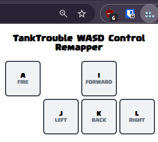

# TankTrouble WASD Control Remapper

**Remap [TankTrouble](https://tanktrouble.com/) WASD control to custom keys.**

### **How to use it?**

1.  Download and unpack the extension.
2. Click on the extension in the *Extensions* menu.
3. This will open a popup window where you can remap keys.
4. Click a UI key to select it (it will change colour), then press the keyboard key you want to map it to.
5. That’s it. The setting will be saved even if you close your browser.

### **Download**
Download the extension (.zip): [**Download**](https://github.com/ForsakenGentleman/tanktrouble-wasd-control-remapper/archive/refs/heads/main.zip)

Tutorial on how to install the extension for Chrome and Firefox: [**Watch this**](https://www.youtube.com/watch?v=dhaGRJvJAII) 
Tutorial on how to install the extension for Edge and Opera: [**Watch this**](https://www.youtube.com/watch?v=qvmFJ5ZkryE)

### **Credits**
Keyboard buttons created by littleicon - Flaticon: [**Flaticon**](https://www.flaticon.com/packs/keyboard-button-17942534)
